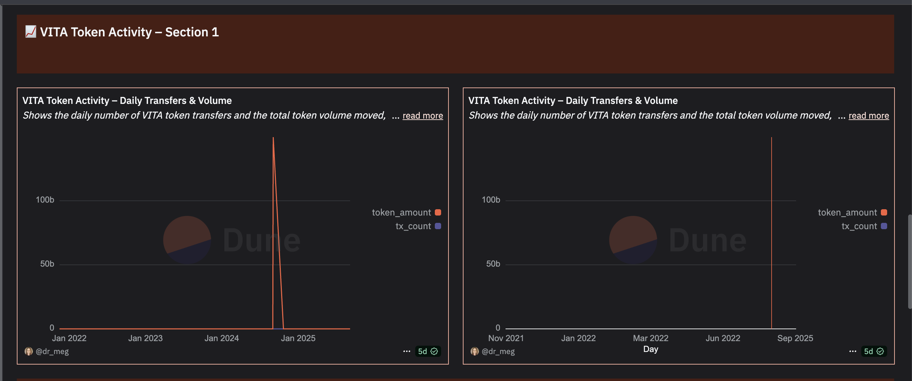

````markdown
# 🔐 Secure Health Login

Production-ready SIWE (EIP-712) + EIP-4337 login layer, deployed on Vercel with Dune analytics.  
**Live Demo (Wallet Connect):** [secure-health-login.vercel.app](https://secure-health-login.vercel.app)

---

## 🚀 Demo Showcase
- 🔑 Wallet login (SIWE, EIP-712) — connect with MetaMask in the live demo  
- 📊 VITA transfers chart:

  
[View live chart on Dune →](https://dune.com/queries/5617908)

- Current release tag: **v0.1.0**

---

## ⚡ Quickstart (Developers)

```bash
pnpm install --dir web
pnpm --dir web run dev
````

Visit [http://localhost:3011](http://localhost:3011) during local development.

---

## 🏥 Secure Health Login — Web3 Authentication for Healthcare

A practitioner-facing authentication demo that replaces passwords with **wallet-based login**.
Built for privacy-first healthcare systems using:

* **SIWE** (Sign-In with Ethereum)
* **EIP-712** structured signing
* **EIP-4337** account abstraction

---

## ✨ Features

* Passwordless login via MetaMask or other injected wallets
* Verified EIP-712 typed data signing for session integrity
* EIP-4337 smart account abstraction support
* Analytics integration via Dune dashboards
* Deployed on Vercel for fast, global access

---

## 📂 Project Structure

* **src/** — Core application and smart contract source
* **test/** — Automated security and reliability tests
* **deployments/** — Environment deployment configs
* **docs/** — Technical references, images, and documentation
* **marketing/** — Recruiter-facing and explanatory materials

---

## 📜 License

All Rights Reserved, Unlicensed

```
```
